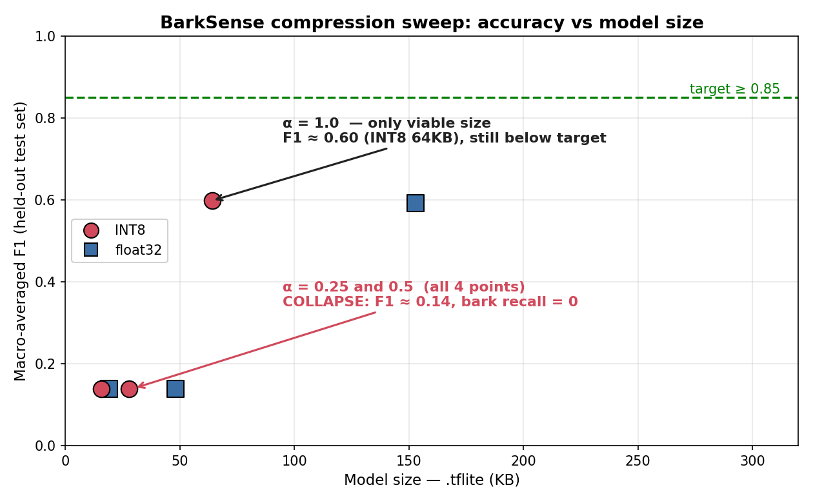
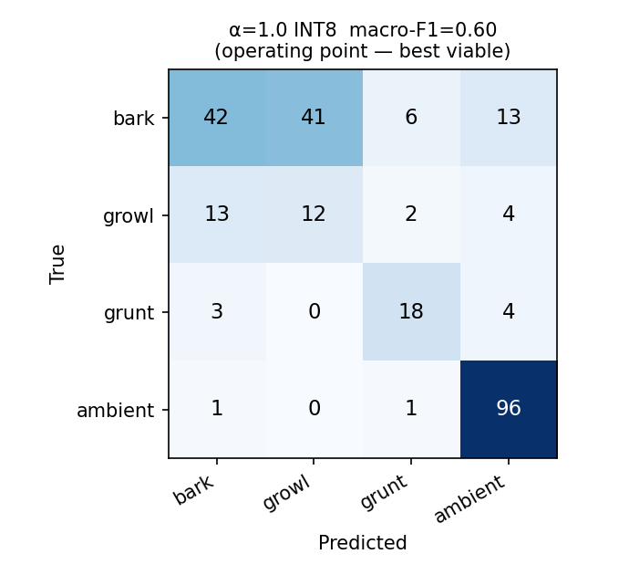
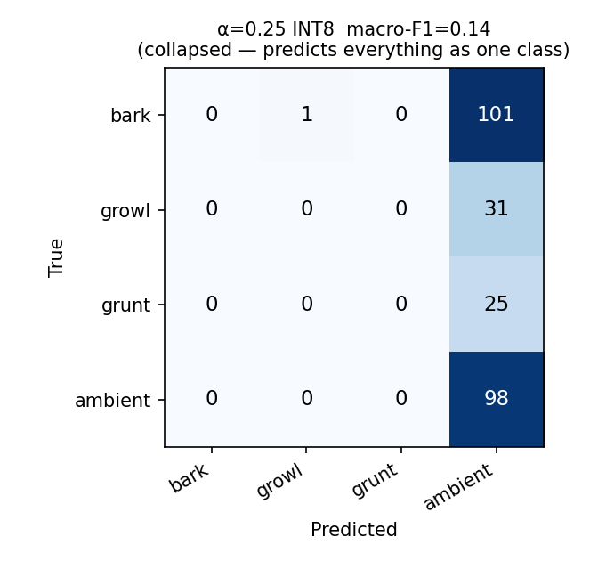

# BarkSense — Presentation Deck (honest version)

> On-device dog-vocalization classifier on a XIAO ESP32S3. Trained from scratch in Keras, quantized with `tf.lite`, run on-chip via TFLite Micro. No cloud, no audio ever leaves the device.

Assets in this folder: `tradeoff_sweep.png`, `cm_a1.0_int8.png`, `cm_a0.25_int8.png`, `eval_results.json`.

---

## Slide 1 — Vision + System

**BarkSense** recognizes *what kind of sound a dog is making*, entirely on-device. A custom DS-CNN classifies 1-second audio windows into four states — **bark · growl · grunt · ambient** — and acts locally:

- **bark** → WiFi push notification to the owner's phone (ntfy.sh)
- **growl** (anxiety/alert) → plays a short clip of the owner's voice through an I2S speaker to calm the dog
- **grunt** → logged locally
- **ambient** → ignored

Privacy by construction: **no audio is recorded, transmitted, or sent to a server** — only a class label + timestamp ever leave the device, and only when the owner opts in. Everything (Keras training → `tf.lite` quantization → TFLite Micro C++ inference) is built by the student. No Edge Impulse, no pre-trained models, no third-party ML pipelines.

```
   ┌─────────────┐   1 s    ┌──────────────┐   120×61   ┌──────────────┐
   │ PDM mic      │ ───────▶ │ log-mel + Δ  │ ─────────▶ │ DS-CNN (INT8)│
   │ (I2S0, 16kHz)│  audio   │ + ΔΔ on-chip │  features  │ TFLite Micro │
   └─────────────┘          └──────────────┘            └──────┬───────┘
                                                                │ argmax (4 cls)
                        ┌───────────────────────────────────────┼───────────────┐
                        ▼                    ▼                    ▼               ▼
                     bark                 growl                grunt           ambient
                        │                    │                    │               │
              WiFi push (ntfy)      play owner-voice         log event         (ignore)
                                    (I2S1 → MAX98357A)
```

---

## Slide 2 — Design Targets (scorecard)

Six measurable success criteria from the proposal, **scored honestly against what shipped.**

| Metric | Target | Actual (best viable: α=1.0 INT8) | Status |
|---|---|---|---|
| Classification accuracy (macro-F1) | ≥ 85% | **60%** | ❌ Miss |
| Per-class recall — bark | ≥ 82% | **41%** | ❌ Miss |
| Inference latency / 1-s window | ≤ 500 ms | feature extract ≈ 150 ms; small model fast — **α=1.0 Invoke intermittently stalls (minutes)** | ⚠️ Conditional |
| Battery life | ≥ 12 h @ 500 mAh | **Not measured** (WiFi always-on) | ⬜ Untested |
| Model flash footprint | ≤ 300 KB | **64 KB** (α=1.0) / 16 KB (α=0.25) | ✅ Pass |
| Peak inference RAM | ≤ 100 KB | **1.8 MB** (α=1.0) / 0.46 MB (α=0.25) — in PSRAM | ❌ Miss (18× / 4.6×) |

**The headline:** the two compute-budget targets that were easy to hit on paper (flash, RAM) split — flash passes comfortably, but the *only* model accurate enough to be useful needs **18× the RAM budget**, forcing it into PSRAM. That single fact drives the whole story below.

---

## Slide 3 — Trade-off Sweep (core deliverable)



DS-CNN width multiplier α ∈ {0.25, 0.5, 1.0} × {float32, INT8}, evaluated on the locked held-out test set.

- **α = 0.25 and α = 0.5 collapse** — macro-F1 ≈ 0.14, **bark recall = 0** (the model predicts essentially one class). Small models do not have the capacity for this 4-class problem on the available data.
- **Only α = 1.0 is viable** (INT8: F1 ≈ 0.60, 64 KB) — and even it misses the 85% target.
- INT8 quantization is **free here**: F1 actually nudges up (0.592 → 0.598) while size drops 153 KB → 64 KB and RAM 7.3 MB → 1.8 MB.

**Takeaway:** there is no point on this curve that satisfies *both* the accuracy target and the RAM target. The viable-accuracy region and the RAM-budget region don't overlap.

---

## Slide 4 — Diagnostic Journey (the strongest part of the story)

Three real failures, each chased to root cause and unlocked with evidence.

| # | Symptom (what we saw) | Root cause (why) | Unlock (what fixed it) |
|---|---|---|---|
| **1. Small models are dead** | α ≤ 0.5 predict one class; bark recall **0**, F1 **0.14** | 4-class task on limited data exceeds tiny-model capacity | Move to **α = 1.0** (F1 0.60) — accepting that it breaks the 100 KB RAM budget |
| **2. Detects "dog" on *everything*** | On device, silence / any noise → `dog ≈ 0.97`, constant false alarms | **PDM mic carries a ~1300 DC offset**; training WAVs are DC-free, so `power_to_db(ref=max)` is dominated by the DC bin → degenerate feature map → model emits a constant class | **Subtract the DC offset per clip** in firmware → a real bark now scores **0.70**, ambient stays ambient |
| **3. Inference freezes for *minutes*** | α=1.0 detection → device "stuck" ~3 min, then catches up | **1.8 MB tensor arena in OPI PSRAM** → `Invoke()` intermittently stalls (marginal PSRAM); compounded by debug flash-logging touching the same memory | **Deploy the small (no-human) α=0.25 model** (arena 0.46 MB) → loop runs smoothly ~1 Hz, real-time; trade accuracy for a working demo |

> Method note: on-device observability was itself a battle — the XIAO's native USB-CDC silently drops `loop()` serial output under load. We isolated failure #3 with a **LittleFS "black box"** (log per-inference, dump at next boot) and reset-triggered boot-log capture.

---

## Slide 5 — Operating Point + Confusion Matrix

**Honest position: there is no operating point that meets every target.** Two relevant points:

| | α = 1.0 INT8 (best accuracy) | no-human α = 0.25 INT8 (shipped for demo) |
|---|---|---|
| macro-F1 (test) | 0.60 | (collapses on human-folded data; the *no-human* variant discriminates live but isn't benchmarked on a no-human test set) |
| arena (on device) | 1.84 MB | **0.46 MB** |
| runtime stability | ❌ stalls for minutes | ✅ stable ~1 Hz |
| live behavior | bark 0.70 / dog 0.95 when it runs | growl 0.70 / dog 0.89, fires reliably, no stall |

**α = 1.0 INT8 confusion matrix** (best viable accuracy):



- Ambient is strong (recall **0.98**) — the device rarely false-fires on quiet/speech.
- **bark ↔ growl confusion** is the main error (bark recall 0.41). Operationally softer than it looks: both trigger a "dog vocalization" response — but it misses the proposal's 82% bark-recall bar.

**α = 0.25 INT8 — the collapse**, for contrast:



Everything is predicted as a single class — this is what "F1 = 0.14" looks like.

---

## Slide 6 — Hardware + System Integration

**Board:** Seeed XIAO ESP32S3 Sense (240 MHz, 8 MB flash, 8 MB OPI PSRAM, onboard PDM mic).

| Function | Peripheral | Pins |
|---|---|---|
| Microphone | Onboard PDM mic (I2S0) | CLK = GPIO 42, DATA = GPIO 41 |
| Speaker amp | MAX98357A (I2S1) | BCLK = D0 (GPIO 1), LRCLK = D1 (GPIO 2), DIN = D2 (GPIO 3) |
| Status LED | Onboard | GPIO 21 |
| Power | 500 mAh LiPo (target) | — |
| Storage | 8 MB flash → 4 MB app + 4 MB LittleFS (`/owner_voice.wav`) | custom `partitions.csv` |

```
        ┌──────────────────────────────┐
        │      XIAO ESP32S3 Sense       │
  PDM   │  GPIO42◀CLK   GPIO41◀DATA     │           ┌──────────────┐
  mic ─▶│  (onboard)                    │  I2S1     │  MAX98357A   │   🔊
        │  D0─BCLK  D1─LRCLK  D2─DIN ───┼──────────▶│   amp        │──▶ speaker
        │  GPIO21 ─ LED                 │           └──────────────┘
        │  USB-C / 500 mAh LiPo         │
        └──────────────────────────────┘
                │ WiFi
                ▼
          ntfy.sh push ──▶ owner's phone
```

> *(Insert enclosure + assembled-board photos here.)*

---

## Slide 7 — Current Progress + Next Steps (honest status)

**What works today (demo-ready):**
- Full pipeline on-device: PDM capture → on-chip log-mel + Δ + ΔΔ → INT8 DS-CNN → action.
- Live bark/growl detection fires reliably: red LED + 1.5 s owner-voice playback + ntfy push to phone.
- Quiet / ambient correctly ignored; real-time (~1 s), no stalls — on the small no-human α=0.25 model.
- Firmware fixes: DC-offset removal, loudness gate before inference, DMA flush (kills latency backlog), all-dog push, capped playback.

**Known gaps (honest):**
- Accuracy below target (macro-F1 0.60 vs 0.85; bark recall 0.41 vs 0.82).
- The accurate α=1.0 model is **not deployable** — its 1.8 MB PSRAM arena stalls inference for minutes.
- The shipped demo model has **no human-speech training** → a person talking may false-trigger.
- Battery life never measured; latency not formally profiled (`esp_timer` over 100 cycles still TODO).

**Next steps:**
1. **PSRAM/inference stability** for α=1.0 (the real blocker): SPIRAM cache workaround, arena placement, or split inference off the loop task.
2. **Train a middle model (α≈0.75)** — possibly stable *and* accurate enough; sweep only covered 0.25/0.5/1.0.
3. **More + better data** to lift bark recall and close the bark↔growl confusion; re-add human-as-ambient once a stable model exists.
4. Formal **latency + battery** measurement against the proposal's validation methods.
